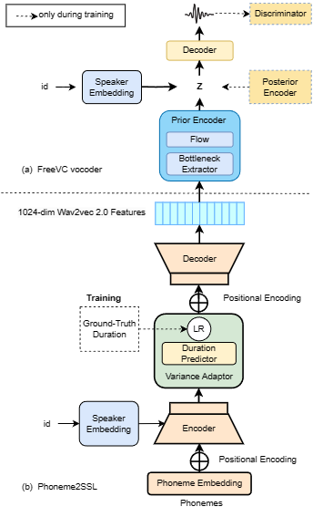

# wv-TTS - PyTorch Implementation

This is a PyTorch implementation of wv-TTS



<!-- # Audio Samples -->

<!-- # Quickstart -->

## Dependencies
You can install the Python dependencies with
```
pip3 install -r requirements.txt
```

## Inference
Prepare a text file containing the content to be inferred, with the following format (see the `./testlist/vctk_test_batch.txt`):

```
basename|speaker|phoneme sequence|raw_text|ground-truth npy file path
```

run:
```
CUDA_VISIBLE_DEVICES=0 python3 synth_batch.py --restore_step 100  --source ./test_list/vctk_test_batch.txt -p config/VCTK/preprocess.yaml -m config/VCTK/model.yaml -t config/VCTK/train.yaml

```
The generated `.npy` files and filelist will be put in ``results``.

# Training

## Datasets

The supported datasets are [LJSpeech](https://keithito.com/LJ-Speech-Dataset/),[AISHELL-3](http://www.aishelltech.com/aishell_3),[VCTK](https://datashare.ed.ac.uk/download/DS_10283_3443.zip).

We take VCTK as an example hereafter.

## Preprocessing
 
First, run 
```
python3 prepare_align.py config/VCTK/preprocess.yaml
```
for some preparations.

As described in the paper, [Montreal Forced Aligner](https://montreal-forced-aligner.readthedocs.io/en/latest/) (MFA) is used to obtain the alignments between the utterances and the phoneme sequences.
Alignments of the supported datasets are provided in `preprocessed_data/VCTK/VCTK.textgrid.tar.gz`.

You have to unzip the files in ``preprocessed_data/VCTK/TextGrid/``.

After that, run the preprocessing script by
```
python3 preprocess.py config/VCTK/preprocess.yaml

```


## Training

Train your model with
```
python3 train.py -p config/VCTK/preprocess.yaml -m config/VCTK/model.yaml -t config/VCTK/train.yaml
```


# TensorBoard

Use
```
tensorboard --logdir output/cas/log/VCTK
```

to serve TensorBoard on your localhost.


Please inform me if you find any mistakes in this repo, or any useful tips to train the FastSpeech 2 model.

# References
- [ming024's FastSpeech implementation](https://github.com/ming024/FastSpeech2)
- [Official FreeVC implementation ](https://github.com/OlaWod/FreeVC)
